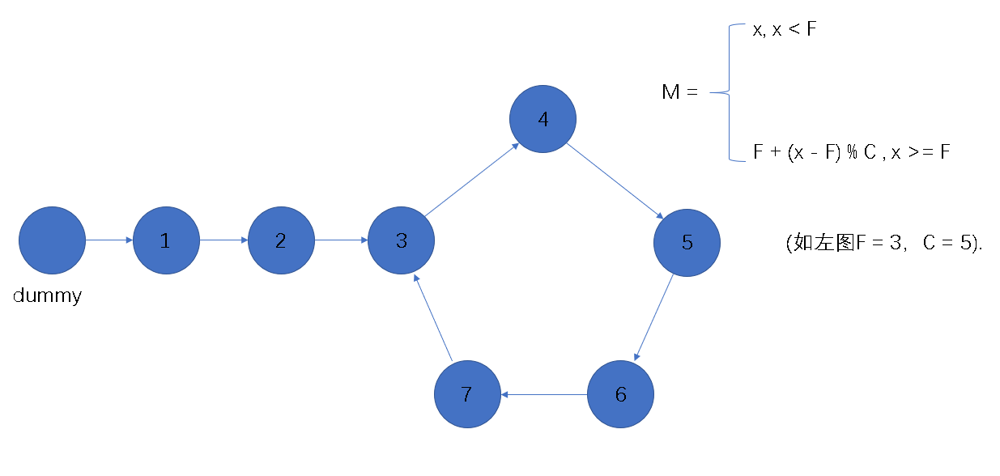

**原文引自我的力扣题解：**[针对Floyd 快慢指针算法阶段二的严格数学证明](https://leetcode-cn.com/problems/linked-list-cycle-ii/solution/zhen-dui-floyd-kuai-man-zhi-zhen-suan-fa-jie-duan-/)

### 双指针解法过程

我们使用两个指针，`fast` 与 `slow`。它们起始都位于链表的头部。随后，`slow` 指针每次向后移动一个位置，而 `fast`指针向后移动两个位置。如果链表中存在环，则 `fast`指针最终将再次与`slow` 指针在环中相遇。 

### 证明

#### 从链表头部出发的步数与最后处于的节点编号的函数关系式

对于一个带环的链表，若在环外（包括入环起始位置的节点）的节点数为F，环内节点数目为C，由链表起始位置出发的步数为x，最终指向的节点编号为M，当x<F时，有M = x; 当x>=F时，有F+(x-F)%C，如下图所示。

#### 步骤

在第一阶段中，慢指针走了x=n步，快指针走了x=2n步.显然n>=F，则M(n)=F+(n-F)%C,M(2n)=F+(2n-F)%C.
此时快慢指针相遇，则M(n)=M(2n).
即F+(n-F)%C = F+(2n-F)%C
即(n-F)%C = (2n-F)%C
则((2n-F) - (n-F))%C = 0.
求得 n%C=0 (*)

阶段二指针一从链表头部出发，指针二从阶段一相遇处出发，两指针相遇且为入环起始位置，有：
M(n+F) = M(F) = F 成立.
M(F) = F 显然成立.
对于M(n+F) = F，有：
M(n+F) = F+(n+F - F)%C = F + n%C
将(*)代入，M(n+F) = F + n%C = F + 0 = F.

所以阶段二的结论是正确的，证毕.
