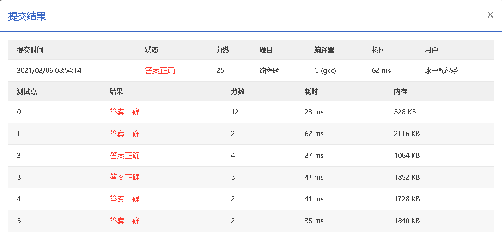

### 题目详情

著名的快速排序算法里有一个经典的划分过程：我们通常采用某种方法取一个元素作为主元，通过交换，把比主元小的元素放到它的左边，比主元大的元素放到它的右边。 给定划分后的 *N* 个互不相同的正整数的排列，请问有多少个元素可能是划分前选取的主元？

例如给定 $N = 5$, 排列是1、3、2、4、5。则：

- 1 的左边没有元素，右边的元素都比它大，所以它可能是主元；
- 尽管 3 的左边元素都比它小，但其右边的 2 比它小，所以它不能是主元；
- 尽管 2 的右边元素都比它大，但其左边的 3 比它大，所以它不能是主元；
- 类似原因，4 和 5 都可能是主元。

因此，有 3 个元素可能是主元。

**输入格式：**

输入在第 1 行中给出一个正整数 *N*（≤105）； 第 2 行是空格分隔的 *N* 个不同的正整数，每个数不超过 109。

**输出格式：**

在第 1 行中输出有可能是主元的元素个数；在第 2 行中按递增顺序输出这些元素，其间以 1 个空格分隔，行首尾不得有多余空格。

**输入样例：**

```in
5
1 3 2 4 5
```

**输出样例：**

```out
3
1 4 5
```

*作者：CAO, Peng*

*单位：Google*

*代码长度限制：16 KB*

*时间限制：200 ms*

*内存限制：64 MB*


### 分析

由题目知，主元的定义是：**在一个列表中，若一个元素左侧的所有的元素都比它小，右侧的所有元素都比它大，则该元素为一个主元。**

因此，若知道了某个元素`a[i]`左侧所有元素的最大值`left`和右侧所有元素的最小值`right`，只要满足`a[i] > left && a[i] < right`即可符合主元的定义。

为了储存每个元素对应的`left`和`right`，需要开辟一个二维数组`dp[len][2]`。其中`len`为题目所给出的正整数列表的长度，每列对应的是列表相应元素，每行分别对应该元素对应的`left`和`right`，求解顺序是按正序递推出每一个`left`，按逆序 递推出每一个`right` 。

因此**时间复杂度**为线性O(2n)= O(n)，**空间复杂度**为线性O(2n)= O(n)。

**边界条件：**从左往右遍历时，`i = 0`时对应的`left`为`dp[0][0] = -Infinity`；从右往左遍历时，`i = len - 1`时对应的`right`为`dp[len - 1][1] = Infinity`。

**状态转移方程：**从左往右遍历时，对每个元素的索引`i`，有`dp[i][0] = max{a[i], dp[i - 1][0]}`；从右往左遍历时，对每个元素的索引`i`，有`dp[len - 1 - i][1] = min{a[i], dp[len - i][1]}`。


### 代码实现

**Python**

```python
length = int(input())
ipt = list(map(int, input().split()))
pivot = []
jud = [[float("-inf"), float("inf")] for i in range(0, length)]
for i in range(1, length):
    jud[i][0] = max(jud[i - 1][0], ipt[i - 1])
    jud[- 1 - i][1] = min(jud[- i][1], ipt[- i])
for i in range(0, length):
    if jud[i][0] < ipt[i] < jud[i][1]:
        pivot.append(ipt[i])
print(len(pivot))
res = ""
for p in sorted(pivot):
    res += "{} ".format(p)
res = res.rstrip()
print(res)
```

**C**

```c++
#include <stdio.h>
#include <limits.h>

int main(){
    int len;
    scanf("%d", &len);
    int ipt[len];
    for (int i = 0; i <= len - 1; ++i) {
        scanf("%d", &ipt[i]);
    }
    int jud[len][2];
    for (int j = 0; j <= len - 1; ++j) {
        if (j == 0){
            jud[j][0] = INT_MIN;
            jud[len - 1 - j][1] = INT_MAX;
            continue;
        }
        if (jud[j - 1][0] > ipt[j - 1]){
            jud[j][0] = jud[j - 1][0];
        } else {
            jud[j][0] = ipt[j - 1];
        }

        if (jud[len - j][1] < ipt[len - j]){
            jud[len - 1 - j][1] = jud[len - j][1];
        } else{
            jud[len - 1 - j][1] = ipt[len - j];
        }
    }
    int pivot[len];
    int last = 0;
    int count = 0;
    for (int k = 0; k <= len - 1; ++k) {
        if (jud[k][0] < ipt[k] && ipt[k] < jud[k][1]){
            pivot[k] = ipt[k];
            last = k;
            count += 1;
        } else{
            pivot[k] = INT_MIN;
        }
    }
    printf("%d\n", count);
    for (int l = 0; l <= len - 1; ++l) {
        if (pivot[l] != INT_MIN){
            printf("%d", pivot[l]);
            if (l != last){
                printf(" ");
            } else{
                break;
            }
        }
    }
    printf("\n");
    return 0;
}
```


### 通过情况

结果为Python代码有测试点超时。

C所有测试点AC，如下：


