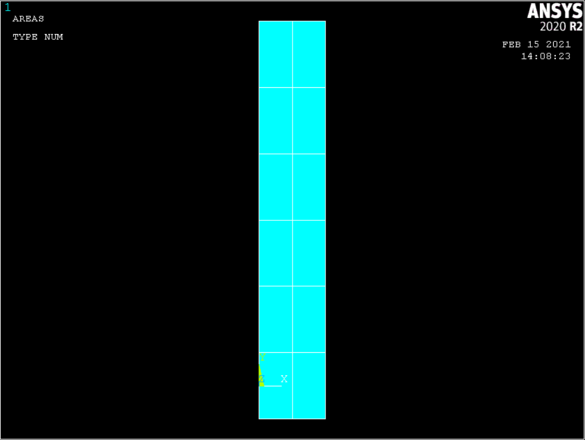
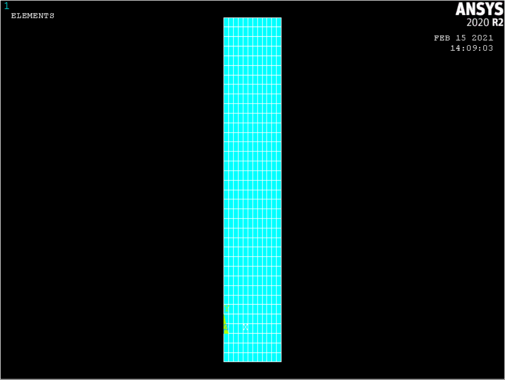
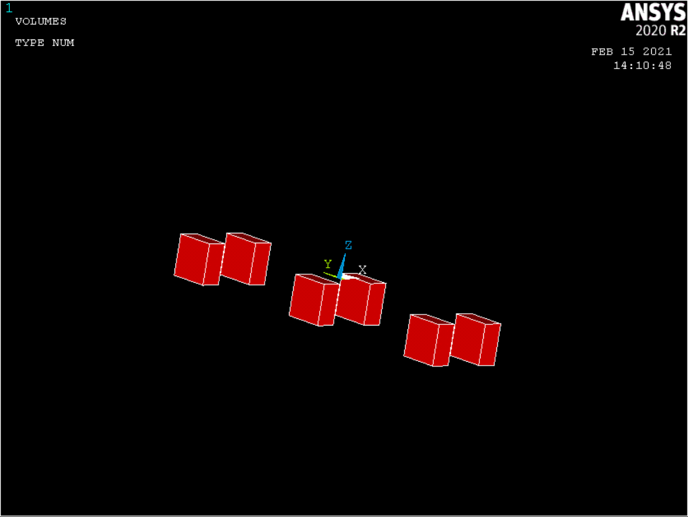
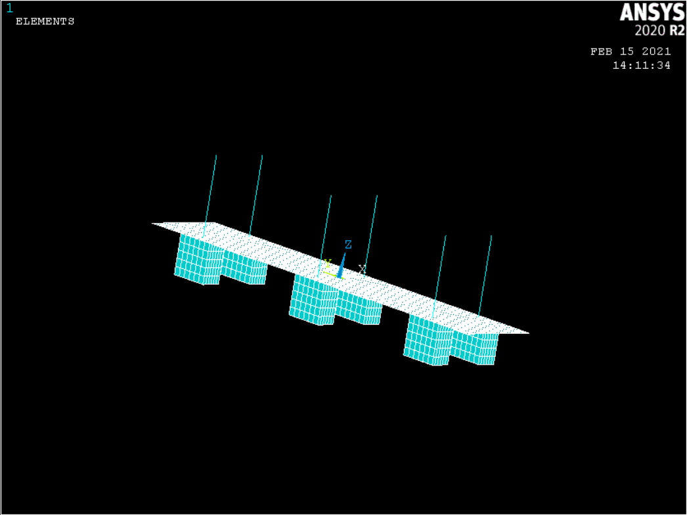
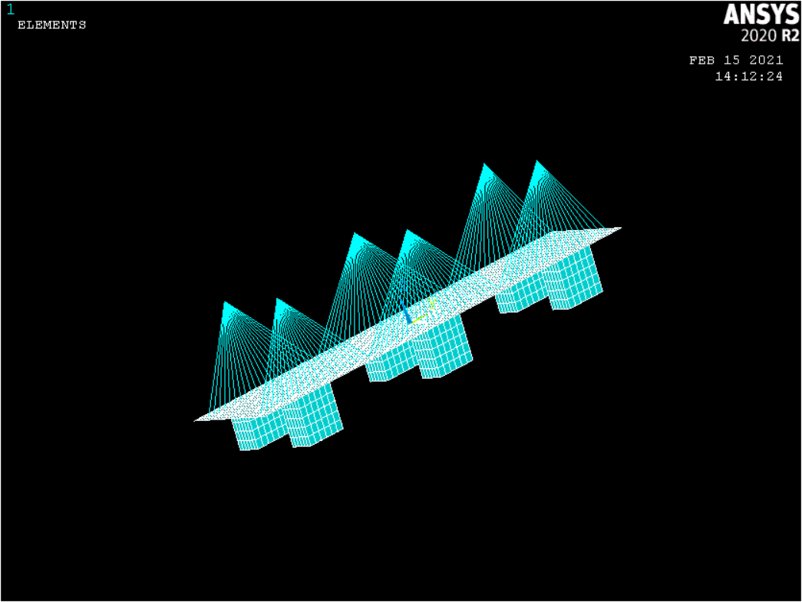
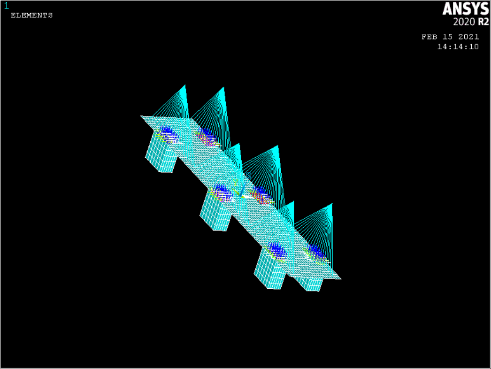

<!-- more -->

### 建模思路和注意事项

1.桥立柱和拉索都使用BEAM188单元，这样连接处不需要特殊处理，只需用NUMMRG命令进行节点的聚合即可，但是注意要分别设置两种不同的截面类型（截面形状和尺寸）

2.桥面使用SHELL181单元，同时要设置其截面类型（主要是厚度）

3.桥墩使用SOLID185单元，因为是三维实体。同时需要注意实体单元和梁单元自由度不同（梁6个、实体3个），不能直接连接，需要用到接触对处理两者连接部分，这也是本算例的难点所在。两者为面面接触（当然本算例中使用点面接触得到的结果也是一样的），目标单元在SHELL181单元上，目标单元采用TARGE170单元，接触单元采用CONTA175单元，参考[Ansys官方文档-单元库](https://ansyshelp.ansys.com/account/secured?returnurl=/Views/Secured/corp/v202/en/ans_elem/Hlp_E_LIBRARY.html)。连接算法采用MPC算法，这样避免使用默认算法进行大量迭代引起求解效率下降，也避免了加入接触刚度引起精度的下降

4.大桥算例为非线性问题，在求解器中修改为大位移静力学分析

5.使桥面分块，便于利用坐标定位，用循环建立桥上立柱和拉索，也方便桥墩拉伸成体和MPC连接建立接触对

### APDL命令流实现

```
!大桥的受力分析 MPC连接处理
FINISH
/CLEAR
/FILNAME, BRIDGE
/PREP7

MP, EX, 1, 2E5
MP, PRXY, 1, 0.3
MP, DENS, 1, 8E-12
MP, MU, 1, 0.2

*SET, L0, 40  !桥面分块长
*SET, B0, 20  !桥面分块宽
*SET, H0, 80  !桥立柱高
*SET, D0, 10  !桥墩深
*SET, R0, 2  !立柱截面半径
*SET, R1, 0.1  !拉索截面半径

ET, 1, SHELL181
ET, 2, BEAM188
ET, 3, SOLID185
ET, 4, PLANE182

SECTYPE, 1, BEAM, CSOLID
SECDATA, R0
SECTYPE, 2, BEAM, CSOLID
SECDATA, R1
SECTYPE, 3, SHELL
SECDATA, D0

!桥面建模
*DO, i, 0, 5, 1
BLC5, B0/2, L0*i, B0, L0
BLC5, 3*B0/2, L0*i, B0, L0
*ENDDO

!镜像桥面
ARSYM, X, ALL
ARSYM, Y, ALL
NUMMRG, ALL, , , , LOW

!桥面划分网格、赋予单元类型
AATT, 1, -1, 1, 0, 3
LESIZE, ALL, , , 6
AMESH, ALL
NUMMRG, ALL, , , , LOW

EXTOPT, ESIZE, 5
EXTOPT, ACLEAR, 0
TYPE, 3

!拉伸桥墩
*DO, i, 0, 2, 1
ASEL, S, LOC, Y, -4*L0+4*L0*i
ASEL, R, LOC, X, 3*B0/2
*GET, AREA1, AREA, , NUM, MIN
VOFFST, AREA1, -L0
NUMMRG, ALL, , , , LOW
K, , 3*B0/2, -4*L0+4*L0*i
*ENDDO

!镜像桥墩
NUMMRG, ALL, , , , LOW
VSYMM, X, ALL
KSEL, S, LOC, X, 3*B0/2
KGEN, 2, ALL, , , 0, 0, H0, , , 0

!立柱建模
*DO, i, 0, 2, 1
KSEL, R, LOC, Y, -4*L0+4*L0*i
*GET, KP1, KP, , NUM, MIN
*GET, KP2, KP, , NUM, MAX
KSEL, S, LOC, X, 3*B0/2
LSTR, KP1, KP2
*ENDDO

!立柱划分网格、赋予单元类型
LSEL, S, LOC, Z, H0/2
LSYMM, X, ALL
LESIZE, ALL, , , 8
LATT, 1, -1, 2, , , , 1
LMESH, ALL

!每个立柱的拉索建模
!第一层循环控制定位到桥面两侧的任意一侧
!第二层循环控制定位每一侧桥面上的每一处立柱
!第三层循环控制一根立柱的所有拉索的建立
!判断语句目的是防止在超出桥面或者立柱的位置上建立拉索
*DO, j, -1, 1, 2
*SET, CUR_X, j*3*B0/2
*DO, i, 0, 2, 1
KSEL, S, LOC, X, CUR_X
*SET, CUR_Y, -4*L0+4*L0*i
KSEL, R, LOC, Y, CUR_Y
KSEL, R, LOC, Z, H0
*GET, KP1, KP, , NUM, MIN
*DO, k, 0, 24, 1
*IF, k, NE, 12, THEN
*SET, CUR, CUR_Y+(L0/6)*k-2*L0
*IF, CUR, ABLT, 11*L0/2, THEN
K, , CUR_X, CUR
*GET, KP2, KP, , NUM, MAX
LSTR, KP1, KP2
*ENDIF
*ENDIF
*ENDDO
*ENDDO
*ENDDO

!除立柱以外的拉索划分网格、赋予单元类型
LSEL, S, LOC, Z, H0/2
*DO, i, 0, 2, 1
*SET, CUR_Y, -4*L0+4*L0*i
LSEL, U, LOC, Y, CUR_Y
*ENDDO

LATT, 1, -1, 2, , , , 2
LESIZE, ALL, , , 6
LMESH, ALL

NUMMRG, ALL, , , , LOW

!建立面——面接触对
*SET, EID, 5
*SET, RID, 3

*DO, j, -1, 1, 2
*SET, CUR_X, j*3*B0/2
*DO, i, 0, 2, 1
ET, EID, TARGE170
*SET, EID, EID+1
ET, EID, CONTA175
!接触单元关键项设置
KEYOPT, EID, 2, 2   !设置接触算法为MPC算法
KEYOPT, EID, 12, 5    !接触行为——绑定接触
R, RID
REAL, RID
*SET, CUR_Y, -4*L0+4*L0*i
ASEL, S, LOC, X, CUR_X
ASEL, R, LOC, Y, CUR_Y
ASEL, R, LOC, Z, 0
NSLA, S
TYPE, EID-1
ESURF   !TARGE单元（目标面）设置
VSEL, S, LOC, X, CUR_X
VSEL, R, LOC, Y, CUR_Y
ASLV, S
ASEL, R, LOC, Z, 0
NSLA, S
TYPE, EID
ESURF   !CONTA单元（接触面）设置
*SET, EID, EID+1
*SET, RID, RID+1
*ENDDO
*ENDDO

/SOLU
ANTYPE, 0
!大位移非线性求解
NLGEOM, 1

ALLSEL, ALL
ASLV, S
ASEL, R, LOC, Z, -L0
NSLA, S
D, ALL, ALL

ASEL, S, LOC, Z, 0
NSLA, S
*GET, NCOUNT, NODE, , COUNT   !获取桥面上所有节点的数目
*SET, FSUM, 10000   !载荷和大小
*SET, PR, -1*FSUM/NCOUNT    !压强
F, ALL, FZ, PR

ALLSEL, ALL
SOLVE

/ESHAPE, 1
/POST1
GPLOT
PLNSOL, S, EQV
```


### 步骤截图



















